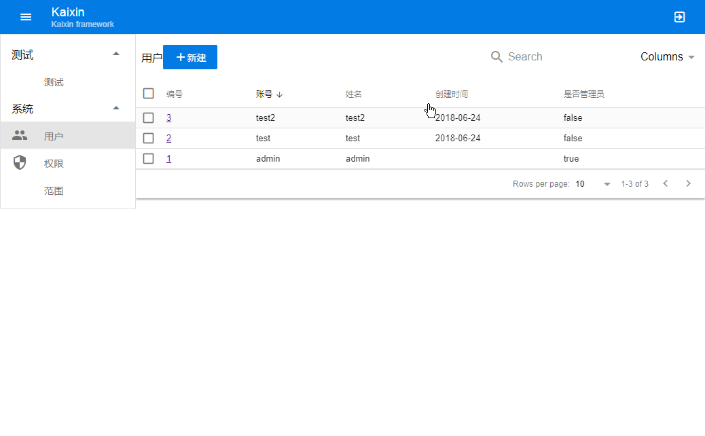

Kaixin是基于多个实际项目，提炼出的快速全栈开发框架:

* 后端基于Java/Dropwizard/Jetty，单命令部署运行
* 开发时使用内置H2数据库和内置Jetty，无需外部数据库和Tomcat依赖，调试方便
* 内置Admin增删改查界面，基于Vue.js/Quasar, 
* 优化的前端代码非常轻量，gzip后约220k，公网加载速度快
* 后端集成Freemarker模板引擎，支持后端Render
* 单命令部署、构建、运行
* Profile驱动，无需修改代码，简化配置数据schema、UI
* 数据库按版本migration，方便升级
* 可单jar文件发布（前端代码打包进jar）
* 简单权限模型（Beta版本）
* 多语支持
* 集成SMTP
* 集成LDAP，可以和Windows域集成

## 运行
安装好java7+, Maven 3+, Nodejs 8+, yarn, quasar-cli

1. build migration #初始化数据库
1. build run       #运行后台
1. build dev       #运行前端admin界面（dev模式）

会自动弹出浏览器访问http://localhost:8080, 缺省登录密码是admin/admin。

## 调试
* 后端的调试直接在Eclipse或IntelliJ调试运行MainApplication.java即可。
* 前端的调试通过build dev运行后，在chrome里调试。

## 配置
服务器配置文件是server.yml, 开发时缺省使用h2数据库，无需安装额外软件。可以通过server.yml修改http端口等设置等。

## 部署
build deploy 可以构建一个部署目录(target\deploy)，前端代码会构建好放在后端下，这个部署目录可以直接拷贝到别的机器运行。部署服务器可以是Windows或Linux，需要先安装好JRE和MySQL。

* 部署目录下的server.yml需要先修改下数据库配置，缺省使用本地的mysql，需要先把数据库创建出来。
* 部署目录下的startup.bat和startup.sh分别是Windows、Linux下的启动脚本，第一次运行前需要带参数执行以初始化数据库，这样做：
  
startup db migrate server.yml

* 以后再运行就直接运行startup即可

## 单文件发布
如果不想按目录部署，可以用build package把整个工程构建为一个jar，生成的jar在target目录下，将这个jar和配置文件server.yml放到任意目录下，直接运行jar即可运行服务器。
java -jar ****.jar

同样的，第一次运行前如果需要初始化数据库，可以带参数来处理，比如：

java -jar ****.jar db migrate server.yml

## 维护
开发时build有几个用于维护的命令

* build dump 可以把当前开发中的h2数据库导出为backup.sql文件，注意这个文件不能用于其他数据库
* build restore 可以恢复之前导出的sql文件
* build resetdb 重置h2数据库（删除所有数据）

服务器运行起来后，后台提供几个维护页面

* 通过http://localhost:8000/sys/dbmng, 访问内置数据管理工具.
* 通过http://localhost:8000/sys/property, 修改服务器端属性.
* 通过http://localhost:8000/sys/logger, 修改服务器端logger.
* 通过http://localhost:8000/sys/metric, 查看服务器端性能统计.

## Profile
前台所有的模型数据、表单由src\main\resources\profile.json驱动，后台数据库由src\main\resources\migrations.xml驱动（支持增量），两者要一致。

## TODO
 * 权限设计优化
 * grid列宽不能调整
 * File组件
 * Rich组件的图片
 * 首页的title可定制
 * 后端读写分离
 * 后端jdbc metric还是ns，需要重新封装jdbc
 * upload接口Edge上传文件名不对
 * assets目录应该重定向到加/

## Bug
 * 创建表单的boolean不能修改 
 * getPermissionsMapByUser guest和指定用户权限会重叠覆盖???

## LICENSE
MIT

